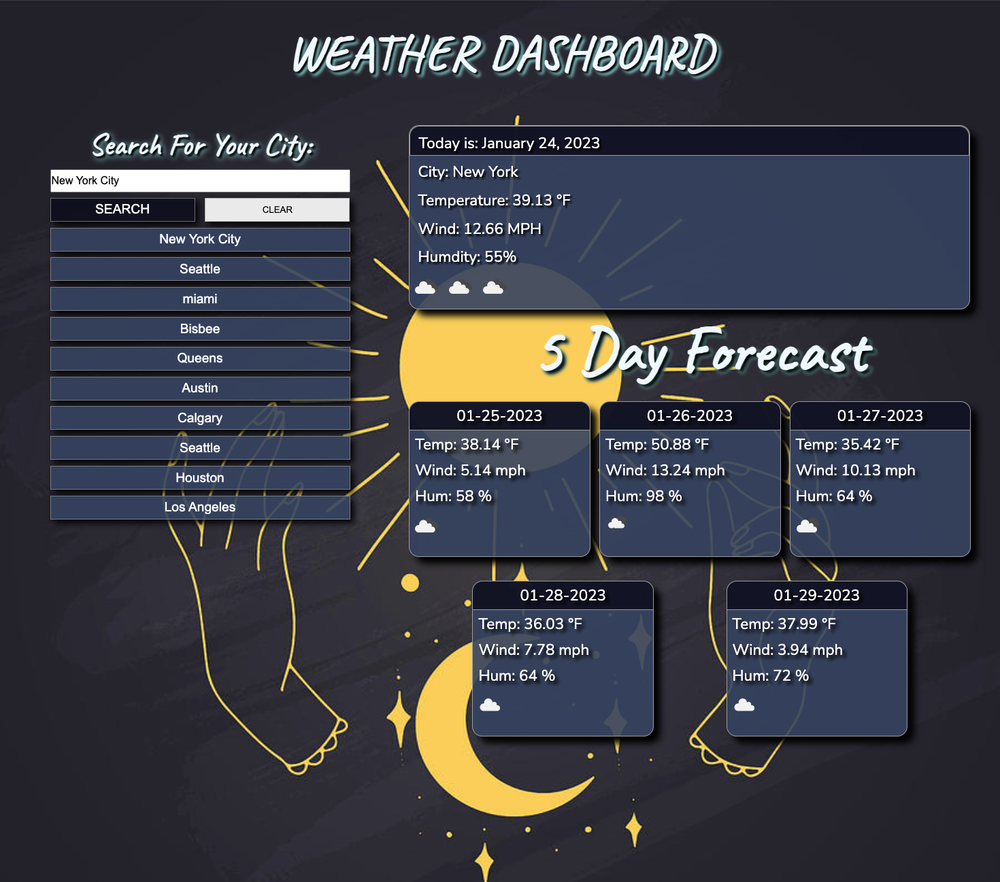
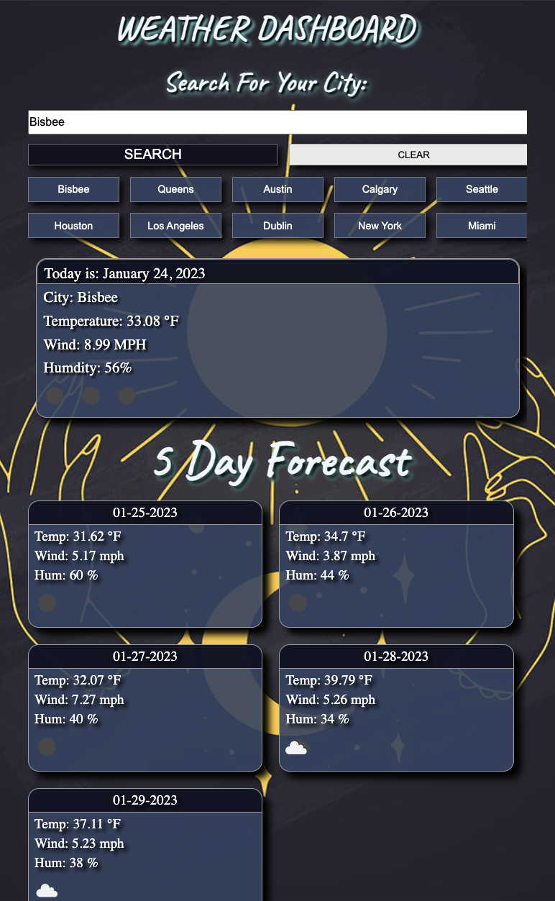

# Weather-Dashboard

## Description:
A responsive weather dashboard created with HTML, CSS, and JavaScript that also utilizes local storage.  When the user inputs a city, they are able to see the current weather as well as the 5 day forecast for that city.  A search history will be created and can hold up to the 10 most recent searches.  When the user exceeds 10 searches, the oldest search will disappear and be replaced with the most recent searches.  
#
## Screenshot:

Browser View

Tablet/Mobile View

#

## Live Link: 
[p0ptartz.github.io/Weather-Dashboard](https://p0ptartz.github.io/Weather-Dashboard/)